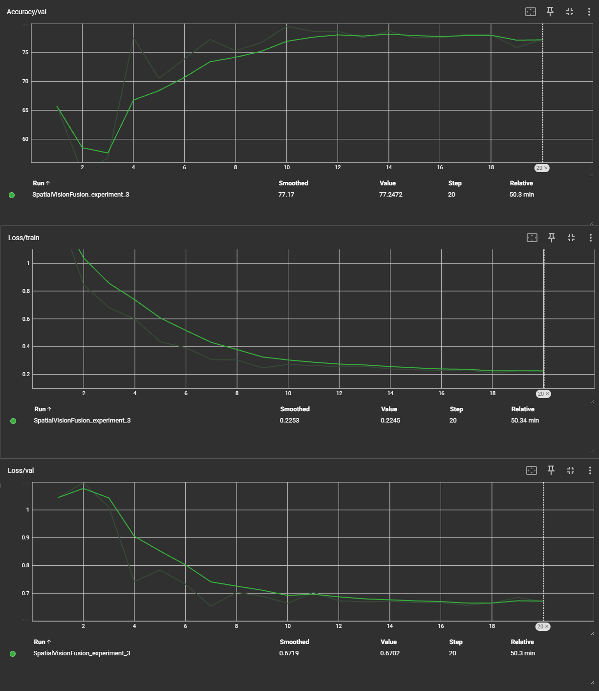

SkinAI is a deep learning system for multi-class classification of dermatological skin lesions using the PAD-UFES-20 dataset. Our goal is to improve diagnostic performance on imbalanced and clinically critical classes (such as melanoma and squamous cell carcinoma) by combining convolutional neural networks with patient metadata.

---

## Project Overview

---

## Source Code

Github Repository: https://github.com/KUMUNoah/Group30-CoolProject/

---

## Reports:

- [Proposal](proposal.md)
- [Status](status.html)
- [Final](final.html)

---

## Dataset

We use the **PAD-UFES-20** dataset:
 - 2,298 clinical images
 - 6 diagnostic classes (BCC, SCC, MEL, ACK, NEV, SEK)
 - 22 patient metadata features

